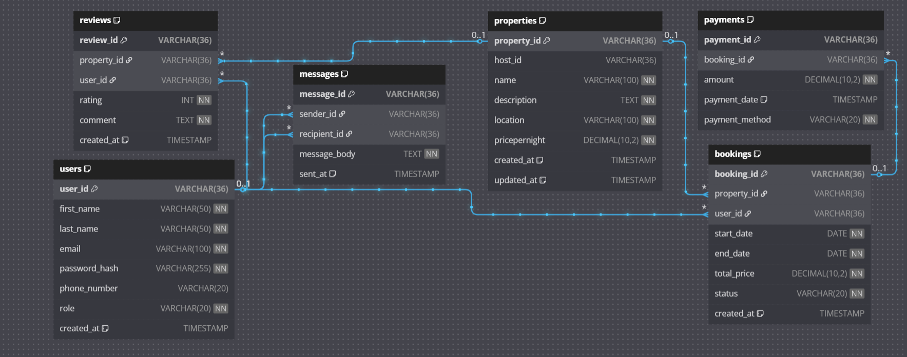

# Requirements Document for Airbnb Database

## Project Overview

This document outlines the requirements and specifications for the Airbnb-like relational database. The primary goal of this database is to manage users, properties, bookings, payments, reviews, and messages efficiently while maintaining data integrity, performance, and scalability.

### ER Diagram

The following ER diagram visualizes the database structure and relationships between entities:

## Entities and Attributes

The database consists of the following main entities: User, Property, Booking, Payment, Review, and Message. Below are the details for each entity and its attributes.

### 1. User Entity

* **Primary Key:** user\_id (UUID, Indexed)
* **Attributes:**

  * first\_name: VARCHAR, NOT NULL
  * last\_name: VARCHAR, NOT NULL
  * email: VARCHAR, UNIQUE, NOT NULL
  * password\_hash: VARCHAR, NOT NULL
  * phone\_number: VARCHAR, NULL
  * role: ENUM (guest, host, admin), NOT NULL
  * created\_at: TIMESTAMP, DEFAULT CURRENT\_TIMESTAMP
* **Indexes:** email (Indexed)

### 2. Property Entity

* **Primary Key:** property\_id (UUID, Indexed)
* **Attributes:**

  * host\_id: Foreign Key, references User(user\_id)
  * name: VARCHAR, NOT NULL
  * description: TEXT, NOT NULL
  * location: VARCHAR, NOT NULL
  * pricepernight: DECIMAL, NOT NULL
  * created\_at: TIMESTAMP, DEFAULT CURRENT\_TIMESTAMP
  * updated\_at: TIMESTAMP, ON UPDATE CURRENT\_TIMESTAMP
* **Indexes:** host\_id (Indexed)

### 3. Booking Entity

* **Primary Key:** booking\_id (UUID, Indexed)
* **Attributes:**

  * property\_id: Foreign Key, references Property(property\_id)
  * user\_id: Foreign Key, references User(user\_id)
  * start\_date: DATE, NOT NULL
  * end\_date: DATE, NOT NULL
  * total\_price: DECIMAL, NOT NULL
  * status: ENUM (pending, confirmed, canceled), NOT NULL
  * created\_at: TIMESTAMP, DEFAULT CURRENT\_TIMESTAMP
* **Indexes:** property\_id, user\_id (Indexed)

### 4. Payment Entity

* **Primary Key:** payment\_id (UUID, Indexed)
* **Attributes:**

  * booking\_id: Foreign Key, references Booking(booking\_id)
  * amount: DECIMAL, NOT NULL
  * payment\_date: TIMESTAMP, DEFAULT CURRENT\_TIMESTAMP
  * payment\_method: ENUM (credit\_card, paypal, stripe), NOT NULL
* **Indexes:** booking\_id (Indexed)

### 5. Review Entity

* **Primary Key:** review\_id (UUID, Indexed)
* **Attributes:**

  * property\_id: Foreign Key, references Property(property\_id)
  * user\_id: Foreign Key, references User(user\_id)
  * rating: INTEGER, CHECK: rating >= 1 AND rating <= 5, NOT NULL
  * comment: TEXT, NOT NULL
  * created\_at: TIMESTAMP, DEFAULT CURRENT\_TIMESTAMP
* **Indexes:** property\_id (Indexed)

### 6. Message Entity

* **Primary Key:** message\_id (UUID, Indexed)
* **Attributes:**

  * sender\_id: Foreign Key, references User(user\_id)
  * recipient\_id: Foreign Key, references User(user\_id)
  * message\_body: TEXT, NOT NULL
  * sent\_at: TIMESTAMP, DEFAULT CURRENT\_TIMESTAMP
* **Indexes:** sender\_id, recipient\_id (Indexed)

## Constraints

1. **User Table:**

   * Unique constraint on email.
   * Non-null constraints on required fields.
2. **Property Table:**

   * Foreign key constraint on host\_id.
3. **Booking Table:**

   * Foreign key constraints on property\_id and user\_id.
   * Status must be one of 'pending', 'confirmed', or 'canceled'.
4. **Payment Table:**

   * Foreign key constraint on booking\_id.
5. **Review Table:**

   * Rating must be between 1 and 5.
   * Foreign key constraints on property\_id and user\_id.
6. **Message Table:**

   * Foreign key constraints on sender\_id and recipient\_id.

## Indexing

Primary keys are automatically indexed. Additional indexes are created for:

* Email in the User table.
* Property ID in the Property and Booking tables.
* Booking ID in the Booking and Payment tables.

## Conclusion

The Airbnb database is designed to efficiently manage user data, property listings, bookings, payments, reviews, and messaging. The structured schema, combined with appropriate indexing and constraints, ensures performance, data integrity, and scalability.
